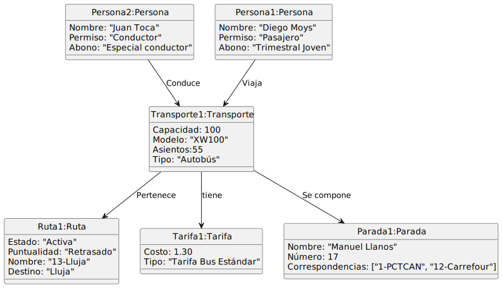

# Proyecto de Modelos de Dominio

Autor: Diego Moys

## Descripción del Dominio

Este proyecto se centra en el modelado del dominio del transporte público de una ciudad. El objetivo es representar las entidades y relaciones clave dentro del sistema de transporte público.

## Modelos de Dominio

### Primera Iteración

La primera iteración del modelo de dominio se realizó durante el parcial sin ayuda de IA, es meramente conceptualización y abstracción a ojo. Esta iteración incluye los siguientes diagramas:

####
[Diagrama de Clases](modelosUML/modeloDeDominioExamenParcial/diagramaClases.puml)

####
[Diagrama de Objetos](modelosUML/modeloDeDominioExamenParcial/diagramaObjetos.puml)

### Iteración con Inteligencia Artificial

La segunda iteración del modelo de dominio, realizada con la ayuda de inteligencia artificial, es una mejora al modelo de dominio previamente visto. Esta iteración incluye los siguientes diagramas:

#### 
[Diagrama de Clases](modelosUML/modeloDeDominioIteracionGPT/diagramaDeClases.puml)

##### 
[Diagrama de Objetos](modelosUML/modeloDeDominioIteracionGPT/diagramaObjetos.puml)

